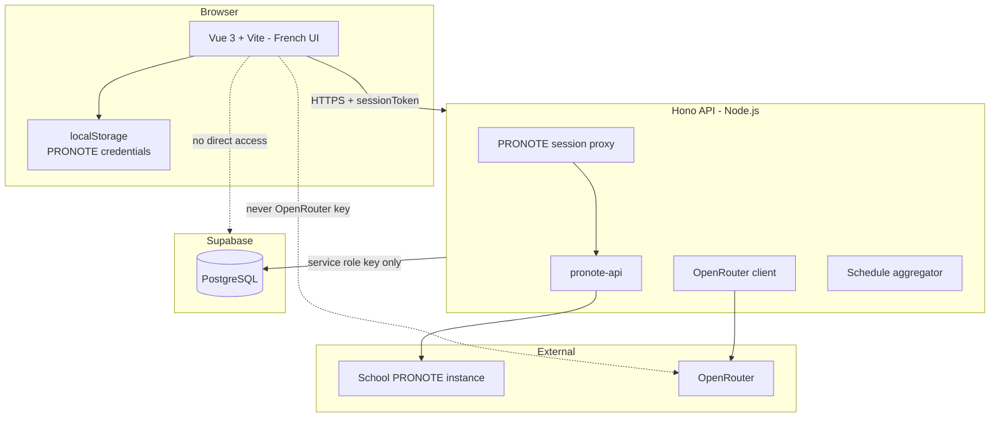

# LaNote — Architecture

Technical companion to [AGENTS.md](../../AGENTS.md).

**When changing architecture, update this file and keep [AGENTS.md](../../AGENTS.md) in sync for any product-level impacts.**

---

## Language

- **Specs & code**: English
- **Application UI**: French (`vue-i18n` or static French copy in components; locale fixed to `fr-FR`)

---

## Overview



---

## Frontend (`apps/web`)

| Dependency | Usage |
|------------|-------|
| `vue`, `vue-router`, `pinia` | UI, routing, state |
| Custom API client | All data via `apps/server` — **no Supabase client** |

**Pinia stores**
- `pronoteCredentials` — read/write `localStorage`
- `pronoteSession` — `sessionToken`, learner name, connection state
- `evaluations` — short-lived PRONOTE data cache (manual invalidation)

**Rules**
- No secret keys in the Vite bundle (no OpenRouter key, no Supabase keys).
- **Never** import `@supabase/supabase-js` or call Supabase URLs from the browser.
- All user-facing strings in French; use a `locales/fr.json` (or equivalent) from the start.

---

## Backend (`apps/server`)

**Runtime**: Node.js 20+, TypeScript, Hono.

**Dependencies**: `pronote-api`, `@supabase/supabase-js` (service role only), OpenRouter HTTP client.

| Route prefix | Responsibility |
|--------------|----------------|
| `/api/pronote/*` | Login, logout, proxy evaluations & *cahier de texte* |
| `/api/activities/*` | Daily activity generation |
| `/api/evaluations/*` | Transient multipart analysis (no file persistence) |
| `/api/plans/*` | Plans & sessions CRUD |
| `/api/sessions/*` | Understood / not-yet feedback |
| `/api/learners/*` | Time budget, profile |
| `/api/schedule/*` | Step 8 aggregation |

**PRONOTE sessions**: stored in Supabase table `pronote_sessions` (not in-memory). On each API request the backend loads `session_data` (jsonb), restores the `pronote-api` client, and writes back if the session mutated. Rows have `expires_at`; expired rows are rejected and deleted. Works on stateless hosts (e.g. Vercel serverless).

**Session token**: the client receives a signed token (HMAC/JWT using `PRONOTE_SESSION_SECRET`) containing the `pronote_sessions.id`. The browser never sees `session_data`.

**OpenRouter**: `POST https://openrouter.ai/api/v1/chat/completions` with configurable models (`OPENROUTER_MODEL_ANALYSIS`, `OPENROUTER_MODEL_ACTIVITIES`). Prompts request French learner-facing output.

**Supabase client**: `@supabase/supabase-js` initialised **only** in the server with `SUPABASE_SERVICE_ROLE_KEY`. No anon key is used.

**Learner identity**: resolved server-side from the PRONOTE session (`pronote_account_hash` → `learners` row). The frontend never authenticates against Supabase.

**Authorization**: the backend scopes every query to the current learner. RLS may exist as defense in depth, but access control is enforced in application code (service role bypasses RLS).

---

## Supabase (backend only, PostgreSQL)

No Supabase Storage. Evaluation images/PDFs are processed in memory and discarded after analysis.

### `pronote_sessions`

| Column | Purpose |
|--------|---------|
| `id` | UUID; referenced by signed client `sessionToken` |
| `learner_id` | FK → `learners` |
| `session_data` | Serialized `pronote-api` session (jsonb); restored server-side per request |
| `expires_at` | TTL; reject and purge stale sessions |
| `updated_at` | Last PRONOTE interaction (for session refresh) |

**Lifecycle**
1. `POST /api/pronote/login` → insert row → return signed token.
2. Authenticated requests → verify token → `SELECT` row → hydrate `pronote-api` → proxy → `UPDATE` if needed.
3. `POST /api/pronote/logout` → `DELETE` row.

**Tables**: see [AGENTS.md](../../AGENTS.md) for full data model.

---

## PRONOTE vs Supabase data flow

```
PRONOTE (source of truth)          Supabase (app enrichment)
─────────────────────────          ───────────────────────────
Evaluation.id          ─────────► ai_analyses.pronote_evaluation_id
Evaluation.subject     (display)   (not stored)
Evaluation.grade       (display)   (not stored)
CahierTexte entry      ──AI──►     daily_activities.activities (generated)
                                   pronote_sessions.session_data (proxy)
                                   learning_plans + plan_sessions
                                   session_feedback
                                   weekly_time_budget
```

Evaluation copy (image/PDF) → backend → OpenRouter → **discarded** (not stored).

---

## Server environment variables

| Variable | Description |
|----------|-------------|
| `OPENROUTER_API_KEY` | OpenRouter API key |
| `SUPABASE_URL` | Supabase project URL (backend only) |
| `SUPABASE_SERVICE_ROLE_KEY` | Service role key — **only** Supabase credential; never expose to frontend |
| `PRONOTE_SESSION_SECRET` | HMAC/JWT secret to sign client `sessionToken` (references `pronote_sessions.id`; not PRONOTE credentials) |
| `CORS_ORIGIN` | Vite frontend origin |

---

## Deployment (target)

| Component | Suggested hosting |
|-----------|-------------------|
| `apps/web` + `apps/server` | **Vercel** (monorepo: static frontend + `/api` serverless Hono handler, Node.js runtime) |
| Supabase | Supabase cloud project |

PRONOTE sessions in Supabase make the API **stateless** — no Redis or long-lived server process required.

**Vercel notes**: use Node.js runtime (not Edge) for `pronote-api` crypto; watch function timeout on AI analysis routes; request body limit applies to evaluation uploads.

The deployment must have outbound access to PRONOTE + OpenRouter.

---

## Local development

```bash
# Terminal 1 — API
cd apps/server && npm run dev   # e.g. port 3001

# Terminal 2 — Web
cd apps/web && npm run dev      # e.g. port 5173, proxy /api → 3001
```

Supabase: local CLI or shared dev project.
